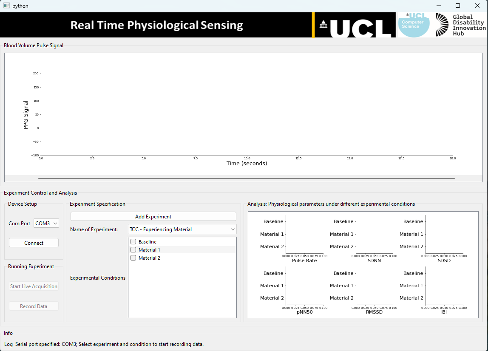
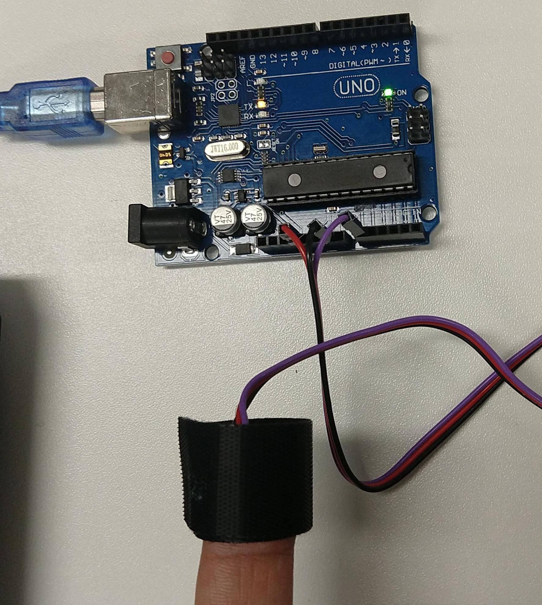

# **PhysComp**
This repo is intended to serve as a basic tool for physiological computing.
Currently, it supports acquiring blood volume pulse or photoplethysmography signal using PulseSensor (https://pulsesensor.com/) connected to PC via Arduino.


## **Installation**
Unzip the package

cd to the directory where requirements.txt is located.

activate your virtual environment

run: pip install -r requirements.txt in your shell.

## **Terminal command to execute the program**
``` bash
python main.py
```
This shall open a UI as below:
<p align="left">

</p>

## **Hardware Setup**
### **PPG**
The setup for PPG is as shown below:
<p align="left">

</p>